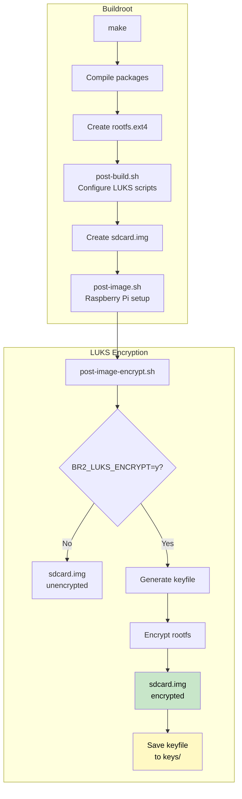
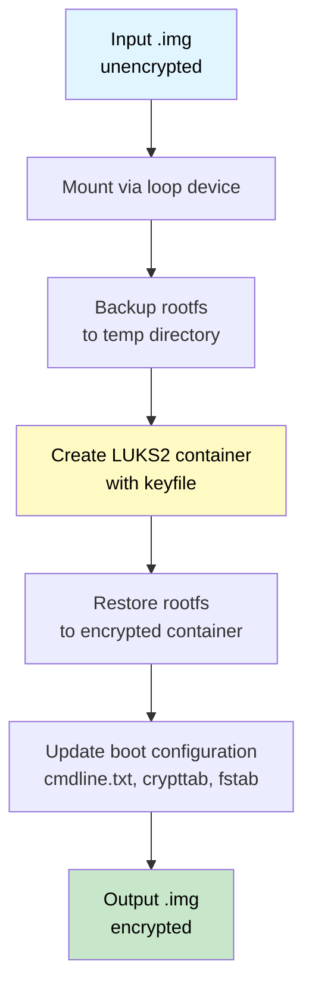
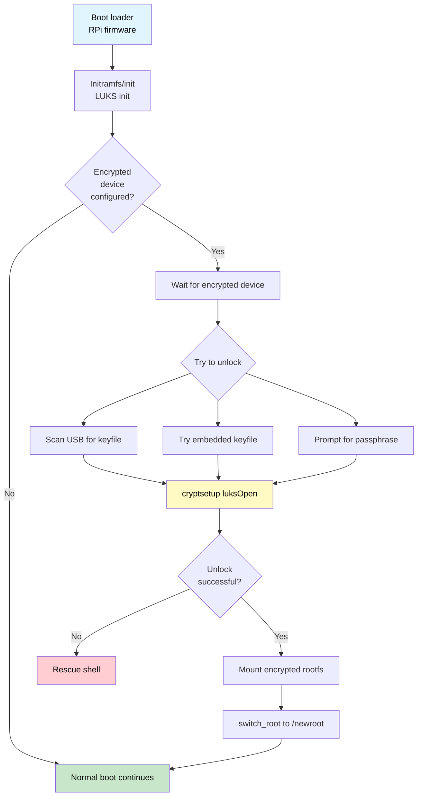

# LUKS Pre-Burn Encryption for Raspberry Pi Buildroot images

Автоматизированное создание зашифрованных .img образов с уникальными LUKS keyfile **до** записи на SD-карту.

## Поддерживаемые устройства

- **Raspberry Pi 5** (`raspberrypi5_luks_defconfig`)
- **Raspberry Pi Zero 2W 64-bit** (`raspberrypizero2w_64_luks_defconfig`)

## Особенности

- **Pre-burn шифрование** — шифрование образа до записи на карту
- **Уникальные ключи** — каждый образ получает свой UUID-based keyfile
- **USB-ключ** — разблокировка rootfs через USB-накопитель с keyfile
- **Пакетная обработка** — создание множества образов за один запуск
- **Buildroot ready** — полная интеграция с Buildroot для RPi5 и RPi Zero 2W

## Быстрый старт

### 1. Шифрование одного образа

```bash
# Генерирует уникальный keyfile и создаёт зашифрованный образ
sudo ./pre-burn-encrypt.sh buildroot.img encrypted.img
```

### 2. Пакетное создание образов

```bash
# Создаёт 10 образов с уникальными ключами
sudo ./batch-encrypt-images.sh buildroot.img 10

# Результат:
# encrypted/device_001.img, device_002.img, ...
# keys/xxxxxxxx-xxxx-xxxx-xxxx-xxxxxxxxxxxx.lek, ...
# manifest.csv — соответствие образов и ключей
```

### 3. Подготовка USB-ключа

```bash
# Форматирование USB-накопителя
sudo mkfs.vfat -F 32 /dev/sdX1

# Копирование ключа
sudo mount /dev/sdX1 /mnt
sudo cp keys/xxxxxxxx.lek /mnt/
sudo umount /mnt
```

### 4. Запись образа на SD-карту

```bash
sudo dd if=encrypted/device_001.img of=/dev/sdY bs=4M status=progress
```

## Структура проекта

```
.
├── pre-burn-encrypt.sh              # Основной скрипт шифрования
├── batch-encrypt-images.sh          # Пакетная обработка
│
└── buildroot-external/              # BR2_EXTERNAL для Buildroot
    ├── external.desc                # Описание external tree
    ├── external.mk                  # Makefile расширений
    ├── Config.in                    # Меню конфигурации LUKS
    ├── pre-burn-encrypt.sh          # Копия скрипта для post-image
    │
    ├── configs/
    │   ├── raspberrypi5_luks_defconfig         # RPi5 defconfig
    │   └── raspberrypizero2w_64_luks_defconfig # RPi Zero 2W defconfig
    │
    ├── scripts/
    │   ├── post-build.sh            # Pre-image подготовка rootfs
    │   └── post-image-encrypt.sh    # Автошифрование после сборки
    │
    └── board/raspberrypi5/
        ├── linux-luks.fragment      # Crypto-модули ядра
        └── rootfs-overlay/          # Файлы для rootfs
            ├── init                 # Initramfs init с LUKS
            ├── etc/init.d/S00cryptroot
            └── usr/bin/sdmluksunlock
```

## Интеграция с Buildroot

### Полная интеграция с BR2_EXTERNAL

Этот метод автоматически шифрует образ после каждой сборки Buildroot.

**1. Клонируйте Buildroot и настройте external tree:**

```bash
git clone https://github.com/buildroot/buildroot.git
cd buildroot

# Укажите путь к этому репозиторию как BR2_EXTERNAL
export BR2_EXTERNAL=/path/to/raspberrypi5-buildroot-luks/buildroot-external
```

**2. Загрузите defconfig:**

```bash
# Для Raspberry Pi 5:
make raspberrypi5_luks_defconfig

# Или для Raspberry Pi Zero 2W:
make raspberrypizero2w_64_luks_defconfig
```

**3. (Опционально) Настройте параметры шифрования:**

```bash
make menuconfig
# → External options → LUKS Disk Encryption
#   [*] Enable LUKS rootfs encryption
#   (aes) Encryption algorithm          # aes для Pi5, xchacha для Pi4
#   () Use existing keyfile             # оставить пустым для автогенерации
#   [ ] Keep original unencrypted image # Сохранять ли оригинальные незашифрованные образы
```

**4. Соберите:**

```bash
make
```

ИЛИ

```bash
make -j$(( $(nproc) / 2 ))
```

**5. Результат:**

```
output/images/
├── sdcard.img              # Зашифрованный образ (заменяет оригинал)
├── sdcard-encrypted.img    # Симлинк на зашифрованный
├── keys/
│   └── <uuid>.lek          # Уникальный keyfile
└── encryption-info.txt     # Инструкции по использованию
```

### Ручное шифрование (без автоматизации)

Если вы хотите шифровать образ вручную после сборки:

```bash
# 1. Соберите Buildroot обычным способом
cd /path/to/buildroot
make raspberrypi5_defconfig
make

# 2. Зашифруйте образ
sudo /path/to/pre-burn-encrypt.sh \
    output/images/sdcard.img \
    output/images/sdcard-encrypted.img
```

### Процесс сборки Buildroot



### Опции Config.in

| Опция | Описание | Default |
|-------|----------|---------|
| `BR2_LUKS_ENCRYPT` | Включить шифрование | n |
| `BR2_LUKS_CRYPTO` | Алгоритм: `aes` или `xchacha` | aes |
| `BR2_LUKS_KEYDIR` | Директория для ключей | $(BINARIES_DIR)/keys |
| `BR2_LUKS_KEYFILE` | Использовать существующий ключ | (пусто) |
| `BR2_LUKS_KEEP_UNENCRYPTED` | Сохранить незашифрованную копию | n |

## Как это работает

### Процесс шифрования (pre-burn-encrypt.sh)



### Процесс загрузки



## Сравнение с sdm

| Аспект | sdm (post-burn) | Этот проект (pre-burn) |
|--------|-----------------|------------------------|
| Когда шифруется | После записи, на загруженной системе | До записи, на хосте |
| Scratch-диск | Требуется | Не требуется |
| Интерактивность | Да (passphrase, initramfs) | Нет (полная автоматизация) |
| Пакетная обработка | Сложно | Да, из коробки |
| Base OS | RasPiOS (Debian) | Buildroot/любая |
| Уникальные ключи | Ручное создание | Автоматическая генерация |

## Опции командной строки

### pre-burn-encrypt.sh

```
--keyfile PATH      Использовать существующий keyfile
--keydir PATH       Директория для сохранения keyfile (default: ./keys)
--mapper NAME       Имя mapper'а (default: cryptroot)
--crypto TYPE       aes или xchacha (default: aes для Pi5)
--keep-passphrase   Также включить разблокировку паролем
--help              Справка
```

### batch-encrypt-images.sh

```
--prefix PREFIX     Префикс имён файлов (default: device_)
--output-dir DIR    Директория вывода (default: ./encrypted)
--key-dir DIR       Директория ключей (default: ./keys)
--manifest FILE     Файл манифеста (default: manifest.csv)
--parallel N        Количество параллельных задач
--crypto TYPE       aes или xchacha
--dry-run           Показать план без выполнения
```

## Требования

- Linux хост с root-правами
- Пакеты: `cryptsetup`, `parted`, `uuid`, `e2fsprogs`, `rsync`
- Для Buildroot: стандартные зависимости

```bash
# Debian/Ubuntu
sudo apt install cryptsetup parted uuid-runtime e2fsprogs rsync
```

## Безопасность

**Важно:**

1. **Храните keyfiles безопасно** — потеря ключа = потеря данных
2. **Создайте резервные копии** ключей в защищённом месте
3. **Не храните ключи вместе с образами** в production
4. **Используйте --keep-passphrase** для резервного способа разблокировки
5. **manifest.csv содержит чувствительную информацию** — защитите его

## Производительность шифрования

### Raspberry Pi 5 (AES-NI)
```
aes-xts-plain64:  ~1800 MiB/s шифрование, ~1900 MiB/s дешифрование
```

### Raspberry Pi 4 (без AES-NI)
```
xchacha20-adiantum: ~170 MiB/s шифрование, ~180 MiB/s дешифрование
aes-xts-plain64:    ~88 MiB/s шифрование, ~108 MiB/s дешифрование
```

Используйте `--crypto xchacha` для Pi4 и более ранних моделей.

## CI/CD с GitHub Actions

Автоматическая сборка образов в облаке:

```bash
# Raspberry Pi 5
gh workflow run build.yml -f board=raspberrypi5 -f encrypt=true

# Raspberry Pi Zero 2W
gh workflow run build.yml -f board=raspberrypizero2w-64 -f encrypt=true
```

### Характеристики бесплатных runners

| Параметр | Значение |
|----------|----------|
| Runner | `ubuntu-24.04` |
| vCPU | 4 (x86_64) |
| RAM | 16 GB |
| Диск | ~14 GB SSD |
| Timeout | 6 часов |

### Время сборки

| Этап | Без кэша | С кэшем |
|------|----------|---------|
| Полная сборка | 1.5-3 ч | 20-40 мин |
| Шифрование | 2-5 мин | 2-5 мин |

### Хранение результатов

| Если настроен | Где хранится |
|---------------|--------------|
| `GDRIVE_CREDENTIALS` | Google Drive: `builds/<date>-<run_id>/` |
| Ничего | GitHub Artifacts (fallback) |

**Google Drive структура:**
```
builds/2025-12-13-12345678/
├── images/sdcard-encrypted.img.xz
├── keys/<uuid>.lek (если автогенерация)
└── build-info.txt
```

**GitHub Artifacts (fallback):**
- `rpi5-luks-images` — образы (30 дней)
- `rpi5-luks-keys` — keyfiles (7 дней, только при автогенерации)

### GitHub Secrets

| Secret | Описание |
|--------|----------|
| `LUKS_KEYFILE_BASE64` | Keyfile в base64 (опционально) |
| `LUKS_PASSPHRASE` | Пароль для шифрования (опционально) |
| `GDRIVE_CREDENTIALS` | Google Service Account JSON |
| `GDRIVE_FOLDER_ID` | ID папки в Google Drive |
| `BOARD_OVERLAY_TAR_BASE64` | Секретный board overlay (tar.gz в base64) |

**Приоритет ключей:** Secret keyfile → Secret passphrase → Автогенерация

**Приоритет хранения:** Google Drive → GitHub Artifacts

### Настройка Google Drive

1. Создайте Service Account в [Google Cloud Console](https://console.cloud.google.com/)
2. Включите Google Drive API
3. Скачайте JSON-ключ
4. Поделитесь папкой в Drive для email сервис-аккаунта
5. Добавьте secrets:

```bash
# JSON credentials
cat service-account.json | gh secret set GDRIVE_CREDENTIALS

# ID папки (из URL: drive.google.com/drive/folders/<ID>)
gh secret set GDRIVE_FOLDER_ID
```

**Структура в Google Drive:**
```
builds/
└── 2025-12-13-12345678/
    ├── images/
    │   ├── sdcard-encrypted.img.xz
    │   └── SHA256SUMS.txt
    ├── keys/
    │   └── <uuid>.lek
    ├── encryption-info.txt
    └── build-info.txt
```

### Секретный Board Overlay

Для хранения конфиденциальных файлов (данные WiFi-сети, скрипты, конфиги):

```bash
# 1. Создайте структуру:
mkdir -p board-secret/rootfs-overlay/etc/NetworkManager/system-connections
mkdir -p board-secret/rootfs-overlay/etc/init.d
mkdir -p board-secret/rootfs-overlay/root

# 2. Добавьте секретные файлы:
#    - cmdline.txt
#    - file_permissions.txt  
#    - rootfs-overlay/...

# 3. Упакуйте и добавьте в secrets:
tar -czf - -C board-secret . | base64 | gh secret set BOARD_OVERLAY_TAR_BASE64

# 4. Запустите сборку:
gh workflow run build.yml -f board=raspberrypi5
```

**Структура секретного архива:**
```
board-secret/
├── cmdline.txt                        # Параметры ядра Linux
├── file_permissions.txt               # Права доступа для файлов
└── rootfs-overlay/
    ├── etc/
    │   ├── NetworkManager/
    │   │   └── system-connections/
    │   │       └── wifi.nmconnection  # Файл WiFi-соединения для NetworkManager
    │   └── init.d/
    │       └── custom-service         # Служба автозапуска
    └── root/
        └── app.py                     # Запускаемое программное обеспечение
```

## Лицензия

MIT License

## Благодарности

- [sdm](https://github.com/gitbls/sdm) — оригинальные скрипты шифрования для Raspberry Pi OS

